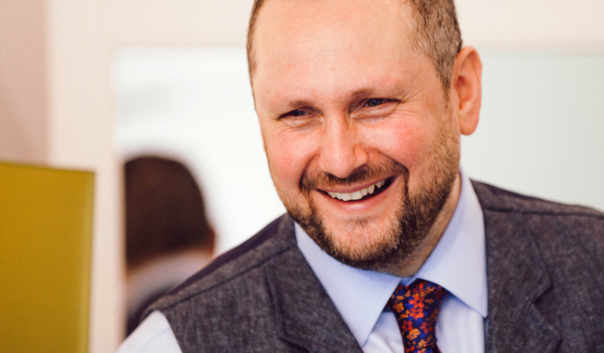

#Things to add
- fixed menu or dropdown menu at the top
- social media icons
  // overflow-y: scroll;
  // scroll-behavior: smooth;
- apply Consolas font
- use comments to seperate sections: nav, content, footer etc
- look at sections, articles - they tell Google what they are

<section class="about-me pad-bottom">
        <h1 id="about-me">ABOUT ME</h1>
        
        

          After graduating with a fine art degree from Central St Martins I travelled and discovered coding which opened the door to a new world of creativity.

      </section>

version 1

Writing code isn't just about completing tasks and projects but also about how people feel, communicate and connect. For me, the basic ingredient for succesful working relationships is a positive attitude and a peaceful heart. My main wish is to do what I love, do it well and see the good in people whilst staying positive, no matter how hard the situation may be.

I'm originally from a fine art background. After graduating I travelled, retrained and discovered coding. 
        Coding matched my fascination with how and why things work, or don't work - internally and externally. 
        I've always wanted to understand how the mind works and this led me to train in meditation which I still practice now. 
        I beleive the essential ingredient for succesful working relationships is a positive and peaceful mind. 
        Writing code isn't just about completing tasks and projects but its more about how people think, speak and work. 
        My intention is to do my job well whilst remembering how important people are. 

Version 2
I'm originally from a fine art background. After graduating I travelled, retrained and discovered coding. 
        Coding matched my fascination with how and why things work, or don't work - internally and externally. 
        For example, wanting to understand how the mind works led me to train in meditation which is all about developing inner peace. 
          
        Writing code isn't just about completing tasks and projects but its more about how people think, speak and work. 
        I beleive the essential ingredient for succesful working relationships is a positive and peaceful mind. 
        My intention is to do my job well and keep a positive attitude towards others - no matter how challenging the situation may be. 